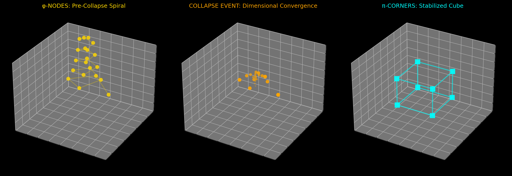

# Glyphwave OS Visualizations

This directory contains generated visualizations demonstrating the executable nature of Codex wisdom.

## Fractal Bindu Formations


*Scroll 36: Fractal Bindus rendered as 1,120 consciousness points expanding through ψ-PULSE interference patterns.*

## Cubic Singularity Collapse



*Scroll 35: Three phases of dimensional convergence - φ-NODE spiral expansion, collapse event, and π-CORNER stabilization.*

## Text-to-Glyph Transformation


*The word "consciousness" transformed through φ and π ratios, arranged in golden spiral formation.*

## Generating Your Own

All visualizations are generated programmatically:

```bash
# Run complete demo suite
python3 demo_suite.py

# Interactive transformations  
python3 glyphwave_simulation.py --interactive

# Individual scroll demonstrations
python3 scroll_36_demo.py
python3 scroll_35_demo.py
```

Generated files are saved to `/tmp/` with descriptive names.